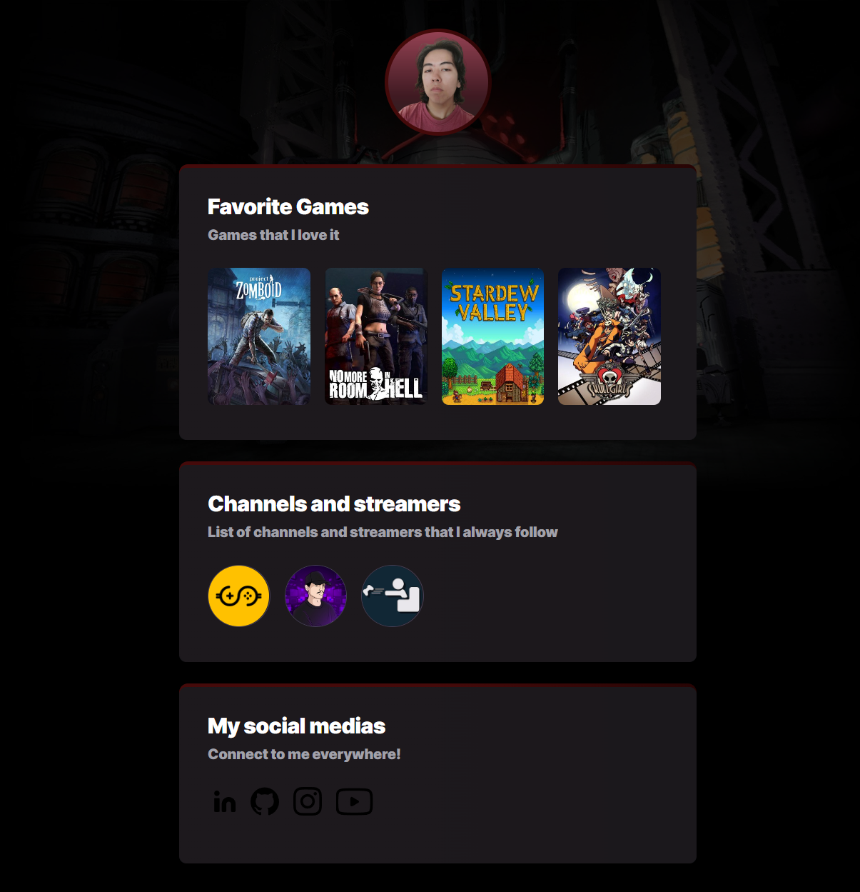

# NLW_eSports

Project builded during the Next Level Week event from Rocketseat (11/09/2022 - 15/09/2022).

## Project Preview

## 🧠 My experience
Learned about the basics of HTML structure, how to style a HTML and create animations to polish the visual with CSS. Also how to host a page using Github.

[🔗 Click here to acess the page](https://alexandremonzen.github.io/NLW_eSports/)

## 👩‍💻 Technologies
- HTML
- CSS
- GIT and Github

## 📞 Contact
https://www.linkedin.com/in/alexandremonzen

alexandremonzen@gmail.com